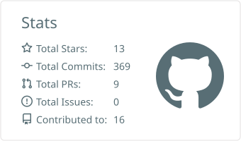
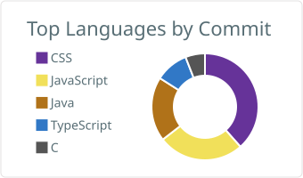

<h1 align="center">Thiago Sousa</h1>

<p align="center">
  <a href="https://git.io/typing-svg">
    
  </a>
</p>

<p align="center">
  <a href="https://www.linkedin.com/in/tpsousa-/"></a>
  <a href="mailto:tpsousa.eng@gmail.com"></a>
  <a href="https://portifolio-thiago-sousa.vercel.app/"></a>
</p>

---

### Sobre mim

Sou graduando em **Ciência da Computação** pela Universidade Federal do Maranhão (UFMA), e construo minha carreira em cima de uma ideia simples: **entender o problema antes de escrever a primeira linha de código.**

```
const thiago = {
  foco: ["Java", "Node.js", "TypeScript", "React"],
  paixao: "arquitetura de sistemas e soluções escaláveis",
  sempreAprendendo: true,
};
```

Tenho experiência prática construindo APIs REST, modelando bancos de dados, implementando autenticação e trabalhando com containers e cloud computing — sempre buscando código limpo e boas práticas de engenharia de software. Atualmente evoluindo em **Back-end, Front-end e DevOps**, sem parar.

---

### Tecnologias

<p align="center">
  
</p>

---

### GitHub

<p align="center">
  
  
</p>
---

<p align="center">
  🔗 <a href="https://portifolio-thiago-sousa.vercel.app/">Portfólio</a>
  •
  <a href="https://www.linkedin.com/in/tpsousa-/">LinkedIn</a>
  •
  <a href="mailto:tpsousa.eng@gmail.com">tpsousa.eng@gmail.com</a>
</p>
